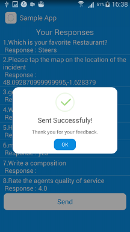

# Big Insights - Mobile Survey and Analytics
Big Insights Android SDK

Deploy Now at http://biginsights.io
#Screenshots





#Quick Setup Instructions

TO INTEGRATE THIS LIBRARY INTO YOUR ANDROID APP, PLEASE FOLOW THE FOLLOWING FEW STEPS

1. Import the library into your IDE

2. Reference the library from your project

3. After doing the above, go ahead and open your AndroidManifest.xml and follow the below steps

 a) Please add the following permissions if they do not exist yet:
 
 ```xml
 <uses-permission android:name="android.permission.INTERNET" />
     <uses-permission android:name="android.permission.VIBRATE" />
     <uses-permission android:name="android.permission.RECEIVE_BOOT_COMPLETED" />
     <uses-permission android:name="android.permission.ACCESS_FINE_LOCATION" />
     <uses-permission android:name="android.permission.ACCESS_COARSE_LOCATION" />
      <uses-permission android:name="android.permission.ACCESS_NETWORK_STATE" />
```

 b) After adding the permissions, please paste the below code somewhere within your ``` <application></application> ``` tags in your Android    Manifest.xml:

```xml
  <!--Initialize Big Insights-->
 <service android:name="io.biginsights.main.notifications.BigInsightsService" />
        <service android:name="io.biginsights.main.notifications.BIPushService" />
         
       <receiver android:name="io.biginsights.main.notifications.BIBootReceiver">
		    <intent-filter >
		        <action android:name="android.intent.action.BOOT_COMPLETED"/>
		    </intent-filter>
       </receiver>
        <receiver android:name="io.biginsights.main.notifications.BI">
		    <intent-filter >
		        <action android:name="init"/>
		    </intent-filter>
       </receiver>
       <activity
            android:name="io.biginsights.main.notifications.BigInsightsMain"
            android:label="@string/app_name" >
        </activity>
        <activity
            android:name="io.biginsights.main.insights.BigInsightsManager"
            android:label="@string/app_name" >
        </activity>
        
        <activity
            android:name="io.biginsights.main.insights.BigInsightsActivity"
            android:label="@string/app_name" >
        </activity>
        
        <meta-data android:name="Big_Insights_ANDROID_API_KEY"
           android:value="your_api_key_here"/>
		   
   <!--End Big Insights-->
   ```
   
 4.In step 3(b) please note the the Big Insights API key section. You need to paste your API key so as to start pushing out surveys to users.
     
	 a) To get your API key, please go to http://biginsights.io , register an account and create a sample Mobile Survey.

	 b) Click on the "PUSH TO APPS" button, you'll be redirected to a page where you can add all your ANDROID apps. 
	 
	 c) Please go ahead and add an app, after which you'll see an autogenerated API KEY, please paste this into the following section in you AndroidManifest.xml:
	 ```
	 <meta-data android:name="Big_Insights_ANDROID_API_KEY"
          android:value="XKjgoyqBDpA0vpx287TnsGaMUijl1C"/>
	 ```


5.Add the following code in the ``` onCreate ``` of your app's Main Activity or Splash Activity to initialize Big Insights on opening the app: 

```java
Intent BI = new Intent(this, io.biginsights.main.notifications.BigInsightsService.class);
         this.startService(BI);
```


6.Having completed step 5 above, please go ahead and run your Android App, you can now begin pushing surveys to everyone using the app in real time.

#UI (optional)

If you want to change the primary colors for your survey, please open the Big Insights SDK color resources (i.e /res/values/colors.xml) and edit the background and text colors (at the top of the file) as you prefer

```xml
<!-- PRIMARY COLORS, CHANGE THESE TWO COLORS TO YOUR LIKING -->
    
     <color name="BigInsightsBackground">#088bdf</color>
     
      <color name="BigInsightsText">#ffffff</color>
      
    <!-- END OF PRIMARY COLORS -->
```

